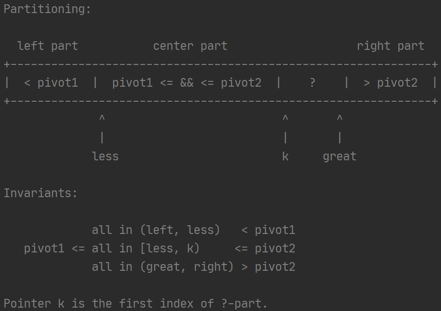
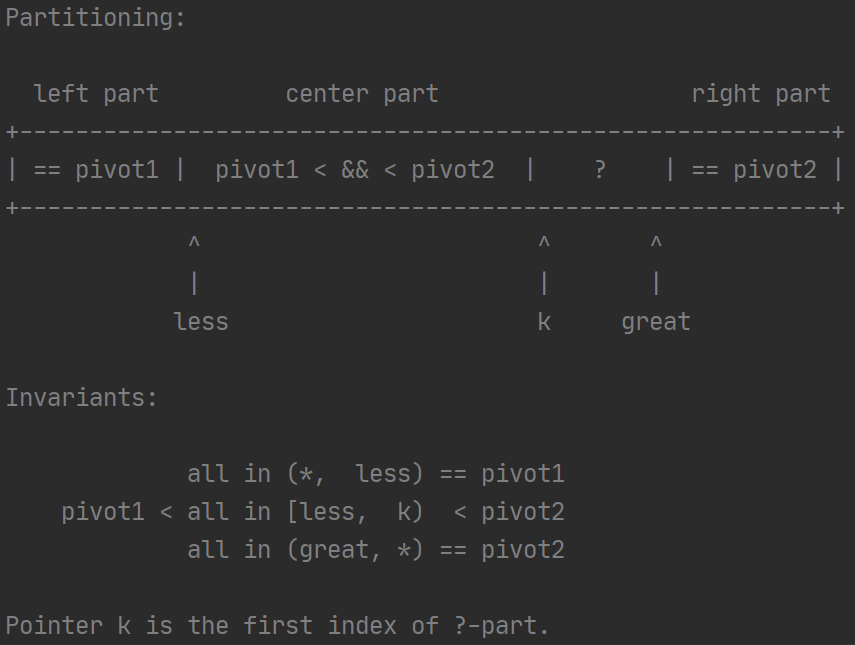
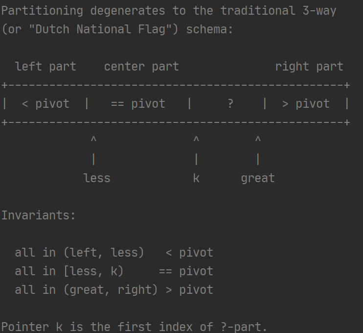
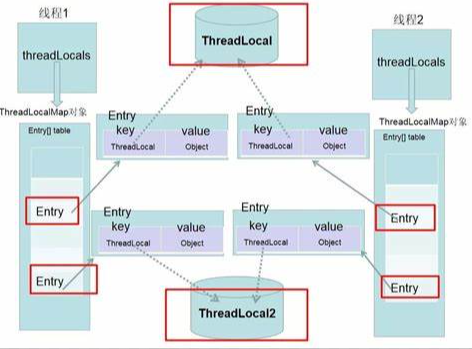

# 1. java包

## 1. util包

### 接口

#### 1.  Collection

```java
public interface Collection<E> extends Iterable<E> {}
```

该结构是整个collection体系所有的root接口，JDK没有直接提供该接口的实现类，而是提供了这个接口子接口（set、List）的实现类。Collection接口的实现类一般**推荐**需要提供两个构造方法：1. 无参构造（创建一个空的集合）；2.带有一个参数的构造方法（用来copy这个参数集合，创建一个和参数集合有相同元素的新集合）。

#### 2.  List

```java
public interface List<E> extends Collection<E> {}
```

list集合是有序的，允许有重复元素，可以通过索引直接操作相应的元素。

#### 3.  Iterator接口

```java
public interface Iterator<E> {}
```

通过Iterator可以遍历集合。Iterator取代了Enumeration接口。

**Iterator与Enumeration的区别：**

1.  Enumeration只有2个函数接口。通过Enumeration，我们只能读取集合的数据，而不能对数据进行修改

   Iteration只有3个函数的接口。Iteration除了能读取集合的数据之外，也能对数据进行删除

2.  Enumeration接口作为一个遗留接口主要用来实现例如 Vector HashTable Stack 的遍历，而Iterator作为比较新的接口，实现了Collection框架下大部分实现类的遍历比如说 ArrayList LinkedList HashSet LinkedHashSet TreeSet HashMap LinkedHashMap TreeMap 等等

3. Iterator支持Fail-Fast机制，当一个线程在遍历时，不允许另外一个线程对数据进行修改（除非调用实现了Iterator的Remove方法）。因此Iterator被认为是安全可靠的遍历方式

虽然两个接口的功能是重复的，但是Iterator由于比Enumeration多了remove方法且接口方法名字更短，因此推荐在后面的类中使用Iterator。

#### 4.  ListIterator接口

```java
public interface ListIterator<E> extends Iterator<E> {}
```

ListIterator的cursor position是处于两个元素之间（previous()和next()两个元素），Iterator的cursor position是指上一个元素的位置。

 **ListIterator接口与Iterator接口的区别：**

1.Iterator在使用过程中，不能对集合元素进行添加操作，否则会抛出异常。

2.使用范围不同；Iterator可以在所有集合中使用，而ListIterator只能在List类型与子类型

3.listIterator有add方法，可以向集合中添加元素，而iterator不能。

4.listiterator和iterator都有hasnext和next方法可以顺序遍历元素， 但是listiterator有hasprevious和previous方法，可以逆向遍历元素

5.listiterator可以定位当前的索引位置 nextIndex和previousIndex可以实现，iterator没有此功能

6.listiterator可以实现对对象的修改set()方法可以实现，iterator仅可以遍历，不能修改。

7.listIterator可以从某一个地方开始遍历

**迭代器有三个属性：**

```java
int cursor;       // index of next element to return，下次要返回的元素索引
int lastRet = -1; // index of last element returned; -1 if no such，上次返回的元素索引
int expectedModCount = modCount;	//记录创建迭代器时的modCount，该参数用来判断在迭代的时候是否对集合进行了操作。
```

迭代器中的remove()、set()等方法都是对上一次返回的值，即上一次返回值的索引（lastRet）处进行修改。


### 类

#### 1.1 Arrays

##### 1.1.1  属性

```java
private static final int MIN_ARRAY_SORT_GRAN = 1 << 13;
```

这是一个决定并行排序是否对排序数据进行分区的阈值（8192）。如果低于该阈值就不将数组分成几部分，低于该阈值不进行partition，可能会导致内存冲突、内存竞争（memory contention），并不一定使并行排序加速。


##### 1.1.2  方法

```java
public class Arrays {}
```

这个类包含各种用来操作数组的方法，例如，排序、搜索等。并且，还有一个静态工厂，将数组转换成（be viewed as）列表list。


```java
// Suppresses default constructor, ensuring non-instantiability.
private Arrays() {}
```

**一个类必须要有构造方法，如果没有提供构造方法，系统会提供一个默认的无参构造；如果你写了构造方法，系统就不在提供构造方法。**

这个私有的构造方法的作用：

1.  为了不让系统提供默认的无参构造
2. 这就保证了这个类不能实例化


```java
private static void rangeCheck(int arrayLength, int fromIndex, int toIndex) 
```

检查从fromIndex到toIndex是不是在arrayLength范围内。如果不在，则抛出异常IllegalArgumentException或者是ArrayIndexOutOfBoundsException。


```
public static void sort(int[] a) {
    DualPivotQuicksort.sort(a, 0, a.length - 1, null, 0, 0);
}
```

将数组进行升序排序，它的实现时双轴的快排，双轴快排比单轴的快，它的排序时间复杂度$O(nlogn)$，即便那些能使其他快排变成$o(n^2)$​的数据。


```java
public static void parallelSort(int[] a) {}
```

对数组进行并行排序，如果数组的长度小于MIN_ARRAY_SORT_GRAN（8192），则直接使用Arrays.sort进行排序；如果大于，则进行对数组partition，分别排序，然后合并。


```java
public static int hashCode(int a[]) {
    if (a == null)
        return 0;

    int result = 1;
    for (int element : a)
        result = 31 * result + element;

    return result;
}
```

返回数组的hash值，哈希值是通过数组中的元素计算得到。


```java
public static int deepHashCode(Object a[]) {}
```

这个是基于深度hash进行计算的，可以理解为进行了两次hash。


```java
public static String toString(int[] a) {}
```

将数组转换成字符串形式。


```java
public static void fill(int[] a, int val) {
    for (int i = 0, len = a.length; i < len; i++)
            a[i] = val;
}
```

数组a中的元素全部变成val，由val进行填充。


```java
public static int binarySearch(int[] a, int key) {}
```

利用二分法进行查找


#### 1.2  DualPivotQuicksort

用到的几个排序算法：

1. **优化后的归并排序（Timsort）**
2. **插入排序，成对插入排序**
3. **单轴快速排序，双轴快速排序**
4. **计数排序**


##### 1.2.1  属性

```java
final class DualPivotQuicksort {}
```

这是一个双轴快速排序，它即便对那些能使其他快排变成$o(n^2)$的数据的时间复杂度也是$O(nlogn)$​。这个类中的方法都是包私有的，它主要是不期望我们进行调用，而是由这个包（java.util）中其他的类公共方法进行调用，如Arrays类。


```java
private DualPivotQuicksort() {}
```

防止进行实例化


 几个阈值：

```java
private static final int INSERTION_SORT_THRESHOLD = 47;
private static final int QUICKSORT_THRESHOLD = 286;
private static final int MAX_RUN_COUNT = 67;
```

如果数组的长度小于INSERTION_SORT_THRESHOLD（47），数组优先使用插入排序，而不是快排；

如果数组的长度小于QUICKSORT_THRESHOLD（286），数组优先使用改进的双轴快排而不是归并排序；

如果数组的长度大于QUICKSORT_THRESHOLD（286），就要根据数组的无序程度来决定采用哪种排序算法，无序程度通过将数组划分为不同的有序数组（run）的个数来判定，如果有序序列的个数大于MAX_RUN_COUNT（67），则认为原数组基本无序，则使用双轴快速排序，如果有序序列的个数小于MAX_RUN_COUNT（67），则认为原数组基本有序，则使用归并排序。

```java
private static final int COUNTING_SORT_THRESHOLD_FOR_BYTE = 29;
```

如果字节数组的长度大于COUNTING_SORT_THRESHOLD_FOR_BYTE（29），使用计数排序而不是插入排序。

```java
private static final int COUNTING_SORT_THRESHOLD_FOR_SHORT_OR_CHAR = 3200;
```

如果char或者short数组的长度大于COUNTING_SORT_THRESHOLD_FOR_SHORT_OR_CHAR（3200），使用计数排序而不是快速排序。


##### 1.2.2  重要方法

```java
private static void sort(int[] a, int left, int right, boolean leftmost) {}
```

这是一个递归快排算法，结束条件与传统的快排不同。当数组的长度小于一定值，就不在使用快排继续递归下去，而是使用插入排序算法进行排序。

递归步骤

​	1. 终止条件： 该方法先判断待排序的长度是否小于INSERTION_SORT_THRESHOLD，如果是就采用插入排序。（leftmost代表是不是数组的最左面的部分，不过是最左面的部分就不能使用成对插入排序，可能会出现数组越界的情况）

​                如果leftmost为true，进行直接插入排序

​				如果leftmost为false，进行成对插入排序

	2. 对数组进行交换，并对每个部分进递归。

```java
// Inexpensive approximation of length / 7
int seventh = (length >> 3) + (length >> 6) + 1;
int e3 = (left + right) >>> 1; // The midpoint
int e2 = e3 - seventh;
int e1 = e2 - seventh;
int e4 = e3 + seventh;
int e5 = e4 + seventh;
//然后，对这5个数进行插入排序
```

如果，这五个数互相不相等，则选取第二个和第四个分别作为pivot1和pivot2，然后对数组进行交换、划分



然后，分别对三个区间进行递归。但如果中间的区间太大，需要对中间区域进行如下操作：（等于pivot1的元素移到左面，等于pivot2的元素移到右面，这样中间区域就稍微缩小一点，再进行递归）



如果五个数存在相等的情况，选取第三个元素作为pivot，对数组进行交换、划分：



然后，对左右两部分进行递归。


**对于int、long、float、double类型数组：**

​		<------insertionSort --- **47**  <----quickSort  ---- > 286  ------mergeSort或者quickSort----->

​	对于float和double会多一步正0与负0的排序。

**对于short、char数组：**

​		<------insertionSort --- **47**  <----quickSort  ---- > 286  ------mergeSort或者quickSort----->**3200** ----CountingSort---->

**对于byte类型数组：**

​		<------insertionSort --- **29**  ----CountingSort  ---- > 


#### 1.3  ArrayList

```java
public class ArrayList<E> extends AbstractList<E>
        implements List<E>, RandomAccess, Cloneable, java.io.Serializable
```


##### 1.3.1   属性

```java
transient Object[] elementData;
```

用来存放元素的。ArrayList的容量就是这个数组的长度

```java
protected transient int modCount = 0;
```

这个属性是AbstractArrayList中的，这个属性表示集合被改变的次数，增加元素，删除元素（Structural modification）它都会加1。该属性主要是用在迭代中，对集合进行迭代的时候modCount属性改变可能就会出错。在使用迭代器遍历集合的时候同时修改集合元素，可能会出现ConcurrentModifiedException。这个属性可以使迭代器引进快速失败机制。（当然，这个属性是可选的。如果你不想在AbstractArrayList子类的迭代器中引进快速失败机制，则可以不使用）

```java
private static final int DEFAULT_CAPACITY = 10;   //默认容器大小
```


#### 1.4  LinkedList

```java
public class LinkedList<E>
    extends AbstractSequentialList<E>
    implements List<E>, Deque<E>, Cloneable, java.io.Serializable
{}
```

LinkedList它的底层是使用的双向链表的形式进行存储数据。数据结构如下：


#### 1.5  HashMap

```java
public class HashMap<K,V> extends AbstractMap<K,V>
    implements Map<K,V>, Cloneable, Serializable {}
```

HashMap的一个bin的数据量超过TREEIFY_THRESHOLD（8）链表就变成红黑树，红黑树进行查找或者增加的时候，会按照二叉搜索树的左小右大进行操作，但是是对key的hash值进行左小右大进行比较，而不是key值本身。因为key是各种类型进行比较不容易，而hash值就是int类型很容易比较大小。

如果一个bin中节点的个数超过TREEIFY_THRESHOLD（8），链表变成红黑树，Node变成TreeNode，属性增多。其实还是以链表的形式存放的，只不过是增加了left、right属性（TreeNode继承LinkedHashMap），能够快速的通过左小右大进行查找，对红黑树的调整也是对left、right、parent等属性进行调整，对next属性的关系不变。


## 2.  lang包

### 2.1  Integer

包装类会涉及到自动拆箱和自动装箱两个概念。自动拆箱：将包装类转换成基本类型；自动装箱：将基本类型分装成对应的包装类。

包装类会将相应类型进行包装，包装类中会有一个属性是相应的基本类型。

```java
Integer i1 = 11;				//这里涉及到自动装箱，调用Integer.valueOf(int)
Integer i2 = i1 + 1;			//这里先进行i1自动拆箱intValue()，然后得到结果之后再进行自动装箱
Integer i3 = i1 + i2;			//这里先进行i1,i2自动拆箱，然后得到结果之后再进行自动装箱
Integer i4 = i1 * i2;			//这里先进行i1,i2自动拆箱，然后得到结果之后再进行自动装箱
i2++;							//这里先进行i2自动拆箱，然后得到结果之后再进行自动装箱，赋值给i2
```

**java的右移运算符：**

java提供两种右移运算符。

​	>>：算术右移运算符，也成带符号右移。用最高位填充移位后左侧的空位。

​	>>>：逻辑右移运算符，也成无符号右移。用0填充移位后左侧的空位。

```java
这个函数返回只有最高位1表示的数字。
*  针对于16位的short，算法右移1,2,4,8.
*  针对于32位的int，算法右移1,2,4,8，16.
*  针对于64位的long，算法右移1,2,4,8,16,32.
public static int highestOneBit(int i) {
    // HD, Figure 3-1
    i |= (i >>  1);
    i |= (i >>  2);
    i |= (i >>  4);
    i |= (i >>  8);
    i |= (i >> 16);
    return i - (i >>> 1);
}
```

```java
public static int lowestOneBit(int i) {
    // HD, Section 2-1
    return i & -i;
}
```


**Assert关键字：**

Assert 断言。默认是关闭断言的，需要在VM Options中-enableassertions或者是-ea。

启用断言且条件为时true，程序将正常执行。但是，如果在启用断言时条件计算为false, JVM会抛出AssertionError，程序会立即停止。

```java
int k = 10;
assert k > 10;
System.out.println(1111);
//结果展示：
//Exception in thread "main" java.lang.AssertionError
```


### 2.2  Math

```java
public final class Math {}
```

Math这个类中的很多方法都是调用StrictMath这个类中相应的方法。


### 2.3  String

```java
public final class String
    implements java.io.Serializable, Comparable<String>, CharSequence {}
```

##### 2.3.1   属性

```java
/** The value is used for character storage. */
private final char value[];   				//用来存放字符的，之后的byte类型而不是char,节约内存
```


### 2.4  StringBuilder

```java
public final class StringBuilder
    extends AbstractStringBuilder
    implements java.io.Serializable, CharSequence
{}
```

##### 2.4.1 属性

```java
/**
 * The value is used for character storage.
 */
char[] value;			//用来存放字符的，之后的byte类型而不是char,节约内存。与String不同的是：这个没有被final修饰，不是常量。默认大小是16
/**
 * The count is the number of characters used.
*/
int count;		//count表示字符的长度。与capacity不同，capacity是指的数组value的长度。
```

##### 2.4.2  方法

```java
public StringBuilder() {
    super(16);							//默认的初始大小是16
}
public StringBuilder(String str) {
        super(str.length() + 16);		//如果传入的是字符串，则开辟的数组大小是字符串的长度+16
        append(str);
}
```

StringBuilder中的方法都是调用父类（AbstractStringBuilder）中的方法。如，append()、delete()、insert()、indexOf()、lastIndexOf()、reverse()。。。。


### 2.5 StringBuffer

```java
public final class StringBuffer
    extends AbstractStringBuilder
    implements java.io.Serializable, CharSequence
{}
```

StringBuffer与StringBuilder一样，都是调用父类AbstractStringBuilder的方法。与StringBuilder不同的是，它是线程同步的，线程安全的。它的没一个方法都被synchronized修饰。


### 2.6  ClassLoader

##### 2.6.1  常用的类加载器以及加载路径

类加载器分为：BootstrapClassLoader(引导类加载器)、ExtClassLoader(扩展类加载器)、APPClassLoader(系统类加载器)。

**BootstrapClassLoader(引导类加载器)：**

```java
加载路径：System.getProperty("sun.boot.class.path");
D:\Program Files\Java\jdk1.8.0_291\jre\lib\resources.jar
D:\Program Files\Java\jdk1.8.0_291\jre\lib\rt.jar
D:\Program Files\Java\jdk1.8.0_291\jre\lib\sunrsasign.jar
D:\Program Files\Java\jdk1.8.0_291\jre\lib\jsse.jar
D:\Program Files\Java\jdk1.8.0_291\jre\lib\jce.jar
D:\Program Files\Java\jdk1.8.0_291\jre\lib\charsets.jar
D:\Program Files\Java\jdk1.8.0_291\jre\lib\jfr.jar
D:\Program Files\Java\jdk1.8.0_291\jre\classes
```

**ExtClassLoader(扩展类加载器)：**

```java
加载路径：System.getProperty("java.ext.dirs")
D:\Program Files\Java\jdk1.8.0_291\jre\lib\ext
C:\Windows\Sun\Java\lib\ext
```

**APPClassLoader(系统类加载器)：**

```java
加载路径：System.getProperty("java.class.path")
D:\Program Files\Java\jdk1.8.0_291\jre\lib\charsets.jar
D:\Program Files\Java\jdk1.8.0_291\jre\lib\deploy.jar
D:\Program Files\Java\jdk1.8.0_291\jre\lib\ext\access-bridge-64.jar
D:\Program Files\Java\jdk1.8.0_291\jre\lib\ext\cldrdata.jar
D:\Program Files\Java\jdk1.8.0_291\jre\lib\ext\dnsns.jar
D:\Program Files\Java\jdk1.8.0_291\jre\lib\ext\jaccess.jar
D:\Program Files\Java\jdk1.8.0_291\jre\lib\ext\jfxrt.jar
D:\Program Files\Java\jdk1.8.0_291\jre\lib\ext\localedata.jar
D:\Program Files\Java\jdk1.8.0_291\jre\lib\ext\nashorn.jar
D:\Program Files\Java\jdk1.8.0_291\jre\lib\ext\sunec.jar
D:\Program Files\Java\jdk1.8.0_291\jre\lib\ext\sunjce_provider.jar
D:\Program Files\Java\jdk1.8.0_291\jre\lib\ext\sunmscapi.jar
D:\Program Files\Java\jdk1.8.0_291\jre\lib\ext\sunpkcs11.jar
D:\Program Files\Java\jdk1.8.0_291\jre\lib\ext\zipfs.jar
D:\Program Files\Java\jdk1.8.0_291\jre\lib\javaws.jar
D:\Program Files\Java\jdk1.8.0_291\jre\lib\jce.jar
D:\Program Files\Java\jdk1.8.0_291\jre\lib\jfr.jar
D:\Program Files\Java\jdk1.8.0_291\jre\lib\jfxswt.jar
D:\Program Files\Java\jdk1.8.0_291\jre\lib\jsse.jar
D:\Program Files\Java\jdk1.8.0_291\jre\lib\management-agent.jar
D:\Program Files\Java\jdk1.8.0_291\jre\lib\plugin.jar
D:\Program Files\Java\jdk1.8.0_291\jre\lib\resources.jar
D:\Program Files\Java\jdk1.8.0_291\jre\lib\rt.jar
F:\JavaProject\ResourceCode\out\production\JDKResourceCode
D:\Program Files\JetBrains\IntelliJ IDEA 2020.1.1\lib\idea_rt.jar
```

APPClassLoader除了加载本工程类，还加载了其他的类。


##### 2.6.2  ClassLoader

```java
public abstract class ClassLoader {}
```

类加载器加载类是通过将类名称转换成文件名，从文件系统中读取该名称的类文件。

每一个类都有一个getClassLoader()方法，获取加载该类的类加载器。

对于数组对象来说，没有类加载器加载，而是在java运行的时候根据需要自动创建。数组的类加载器返回值是数组元素的类加载器。如果元素是基本数据类型，数组就没有类加载器。

可以实现ClassLoader的子类，自定义类加载器，可以扩展类加载的方式以及加载的路径。

类加载的方式默认是双亲委派机制。

一些类并不是一个文件，他们可能来自于网络或者应用产生的。defineClass(String, byte[], int, int)这个方法可以将byte数组转换成类，产生的类可以通过Class.newInstance进行实例化。

###### 属性：

```java
private final ClassLoader parent;	//这个类加载器的parent
private final ConcurrentHashMap<String, Object> parallelLockMap;  //这个map集合的key就是要加载类的类名（字符串形式），value是new Object()。value主要是代表这个类的锁
```

###### 方法：

```java
public Class<?> loadClass(String name) throws ClassNotFoundException {
    return loadClass(name, false);
}
//参数说明：name表示要被加载的类的类名；resolve表示加载完之后是否对类进行解析
protected Class<?> loadClass(String name, boolean resolve)
        throws ClassNotFoundException
    {
        synchronized (getClassLoadingLock(name)) {		//getClassLoadingLock(name)返回这个类name对应的锁（parallelLockMap的value值），因此加载一个类是线程安全的
            // First, check if the class has already been loaded
            Class<?> c = findLoadedClass(name);		//findLoadedClass()里面调用了本地方法，查找是不是已经加载过该类
            if (c == null) {
                long t0 = System.nanoTime();
                try {		//先交给父类加载器进行加载，此处体现了双亲委派机制
                    if (parent != null) {
                        c = parent.loadClass(name, false);
                    } else {
                        c = findBootstrapClassOrNull(name);
                    }
                } catch (ClassNotFoundException e) {
                    // ClassNotFoundException thrown if class not found
                    // from the non-null parent class loader
                }

                if (c == null) {
                    // If still not found, then invoke findClass in order
                    // to find the class.
                    //父类加载器无法加载，就需要自己去加载
                    long t1 = System.nanoTime();
                    c = findClass(name);	//寻找类，这个方法需要重写。一般建议重写findClass()，而不是loadClass()。除非打破双亲委派机制

                    // this is the defining class loader; record the stats
                    sun.misc.PerfCounter.getParentDelegationTime().addTime(t1 - t0);
                    sun.misc.PerfCounter.getFindClassTime().addElapsedTimeFrom(t1);
                    sun.misc.PerfCounter.getFindClasses().increment();
                }
            }
            if (resolve) {
                resolveClass(c);		//该方法调用了本地方法，对类进行解析
            }
            return c;
        }
    }
```

**loadClass(String name, boolean resolve)的步骤：**

1.  检查该类是否已经加载；
2.  如果没有加载过，则交给父加载器进行加载
3.  如果父加载器没有加载成功，则通过findClass()自己寻找
4.  根据需求判断是否对该类进行解析。


### 2.7  ThreadLocal

```java
public class ThreadLocal<T> {}
```

ThreadLocal实例一般是作为类（与线程相关的类）的静态私有属性

每个线程都有它它们各自的线程局部变量表。线程一旦没了，它的局部变量表也就会被垃圾回收机回收。

这个类中的方法set()就是往TheadLocalMap中插入Entry，get()就是从TheadLocalMap中的Entry[]数组中取出符合条件的Entry。


### 2.8  ThreadLocalMap

```java
static class ThreadLocalMap {}
```

ThreadLocalMap是ThreadLocal的静态内部类，Entry是ThreadLocalMap的静态内部类，继承虚引用。Entry主要两个属性：1. 引用（ThreadLocal的虚引用，key，与后面的value没有任何关系，他和thread-local对象有关）；2.Object对象（thread-local 对象的副本，不要放thread-local对象）

##### 属性：

```java
/**
 * The initial capacity -- MUST be a power of two.
 */
private static final int INITIAL_CAPACITY = 16;			//默认table数组的大小
/**
 * The table, resized as necessary.
* table.length MUST always be a power of two.
*/
private Entry[] table;		//存放Entry对象
/**
 * The next size value at which to resize.
 */
 private int threshold; // Default to 0  数组table扩充的阈值，超过阈值进行2倍扩充
/**
* The number of entries in the table.
*/
private int size = 0;
```

```java
//计算thread local对象的hash值，然后存储在thread local对象threadLocalHashCode这个属性上
private final int threadLocalHashCode = nextHashCode();
private static AtomicInteger nextHashCode =
        new AtomicInteger();
private static final int HASH_INCREMENT = 0x61c88647;
private static int nextHashCode() {
    return nextHashCode.getAndAdd(HASH_INCREMENT);
}
```

ThreadLocalMap的存储Entry的底层也是利用hash算法，只是解决hash冲突是使用的开放定址算法。因此，ThreadLocalMap的很多算法都是对开放定址进行运算，删除、增加、扩容、获取Entry等。

每一个Thread都有一个ThreadLocalMap，存在属性ThreadLocal.ThreadLocalMap threadLocals上

结构图：




## 3.  ref包

### 3.1  Reference


**软引用（SoftReference）：**


**弱引用（WeakReference）：**


**软引用（PhantomReference）：**


**引用队列（ReferenceQueue）：**

引用队列配合软引用、弱引用、虚引用一起使用。当软、弱引用的对象将要被JVM回收时，会将其加入到引用队列中。虚引用在创建的时候就加入到引用队列中。

通过引用队列可以了解JVM垃圾回收情况。


## 4.  annotation包

java注解是在JDK5时引入的新特性，目前大部分框架(如Spring)都使用了注解简化代码并提高编码的效率。

**元注解：**标记其他注解的注解。

1.  @Target 用来约束注解可以应用的地方（如方法、类或字段），其中ElementType是枚举类型。当注解未指定Target值时，则此注解可以用于任何元素之上，多个值使用{}包含并用逗号隔开。
2. @Retention用来约束注解的生命周期，分别有三个值，**源码级别**（source，注解将被编译器丢弃，该类型的注解信息只会保留在源码里，源码经过编译后，注解信息会被丢弃，不会保留在编译好的class文件里，如，@Override、@SuppressWarnning），**类文件级别**（class，注解在class文件中可用，但会被VM丢弃，该类型的注解信息会保留在源码里和class文件里，在执行的时候，不会加载到虚拟机中，请注意，当注解未定义Retention值时，默认值是CLASS，如Java内置注解，@Deprecated等）或者**运行时级别**（runtime，注解在class文件中可用，但会被VM丢弃（该类型的注解信息会保留在源码里和class文件里，在执行的时候，不会加载到虚拟机中），请注意，当注解未定义Retention值时，默认值是CLASS，如Java内置注解，@Override、@Deprecated、@SuppressWarnning等）
3. @Documented 被修饰的注解会生成到javadoc中。被这个元注解修饰的注解，通过javadoc生成的帮助文档会有这个注解。
4. @Inherited 可以让注解被继承，但这并不是真的继承，只是通过使用@Inherited，可以让子类Class对象使用getAnnotations()获取父类被@Inherited修饰的注解


**java内置注解：**

- @Override：用于标明此方法覆盖了父类的方法
- @Deprecated：用于标明已经过时的方法或类
- @SuppressWarnnings:用于有选择的关闭编译器对类、方法、成员变量、变量初始化的警告


**注解元素及其基本类型：**

​			注解没没有任何元素的注解称为标记注解（marker annotation）

注解元素的基本类型：所有基本类型、String、Class、enum、Annotation、以及他们对应的数组。

定义方式：

```java
public @interface DBTable {    
    String name() default ""; 			//类似于方法的声明
}
```

声明注解元素时可以使用基本类型但不允许使用任何包装类型。

编译器对元素的默认值有些过分挑剔。首先，元素不能有不确定的值。也就是说，元素必须要么具有默认值，要么在使用注解时提供元素的值。其次，对于非基本类型的元素，无论是在源代码中声明，还是在注解接口中定义默认值，都不能以null作为值。

注解中定义了名为value的元素，并且在使用该注解时，如果该元素是唯一需要赋值的一个元素，那么此时无需使用key=value的语法，而只需在括号内给出value元素所需的值即可。这可以应用于任何合法类型的元素，记住，这限制了元素名必须为value。


**注解与反射：**

为了运行时能准确获取到注解的相关信息，Java在java.lang.reflect 反射包下新增了AnnotatedElement接口，它主要用于表示目前正在 VM 中运行的程序中已使用注解的元素，通过该接口提供的方法可以利用反射技术地读取注解的信息，如反射包的Constructor类、Field类、Method类、Package类和Class类都实现了AnnotatedElement接口。

  

### 1. Annotation接口

注解不支持继承，因此不能使用关键字extends来继承某个@interface，但注解在编译之后，编译器会自动继承Annotation接口。

定义注解都使用@interface，这就表示继承了Annotation接口。
