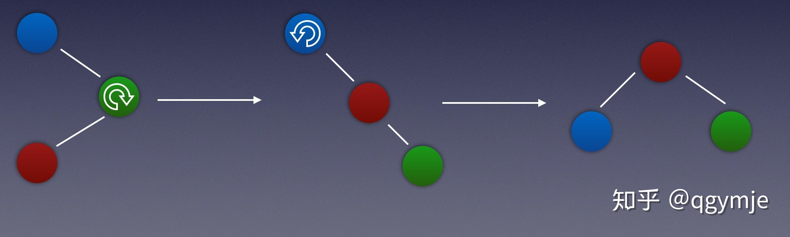

# 1. 排序算法

## 1.  归并排序

### 1.1 普通归并排序

归并排序比较适用于处理较**大规模的数据**，且比较消耗内存。所以小规模的序列，一般不使用归并排序。

**基本思想：**

​	就是“分治”思想，先将序列元素拆解，然后归并，即合并相邻有序子序列。

### 1.2  优化后的归并排序（TimSort）

**自适应、稳定、高效的排序算法，源自合并排序和插入排序。**

我们来进行归并排序的时候，就进行了许多没必要的“分”，因为有些子序列本来就是有序的了，随而也导致没必要的“治”。TimSort就是为了解决这一缺陷而生。

**Timsort的思想是**，“分”的时候，直接从左往右，划分成各种不同长度的、有序的子序列（每个子序列叫做一个run，），然后对这些子序列进行归并，这样一来，复杂度就大大降低了。

有序的子序列（Run）：递增的序列或者是严格递减的序列（保证算法的稳定性，递减的序列需要进行翻转）。

minRun：最小的有序子序列的长度。如果有一个run的长度没有达到minrun，那就要从run序列后面的元素进行二分插入放入到run中，直到run的长度达到最小minrun。

minrun的选择：16-64之间，数组的长度/minrun 略小于等于2的次幂。

子序列合并：

​	需要使用栈。从第一个run开始依次入栈，每入栈一次，就要检查：

直到栈中所有run都满足上述要求，继续将下一个run放入到栈中。最终合并成一个。（为什么上图这么合并：如果违反了下面的两条规则，则Y与X、Z中的较小者合并。规则使得合并保持近似平衡，同时在延迟合并以实现平衡）

## 2.  插入排序

### 2.1 直接插入排序

**基本思想**：序列分为两部分，一部分有序，一部分无序，不断从无序的部分选元素出来，插入到有序的部分。（一开始是认为第一个元素是有序的部分，其他元素都是无序的部分）

插入排序一般应用于数据量较小的序列排序中。因为插入排序在小数组中已经表现的很好了。

### 2.2  二分插入排序

与直接插入排序不同点是：直接插入排序是待插入的元素依次和前一个元素进行比较、交换，直到满意位为止；二分插入排序是先从有序数组中通过二分查找确定待插入的位置，然后将后面的元素依次后移一位，并将带插入元素插入其中。减少了比较次数。

### 2.3  成对插入排序

在直接插入排序里面，我们在进行插入的时候，需要在每次循环时，不断与有序的元素进行比较，直到找到合适位置。而比较次数与移位次数是衡量一个算法优劣的标准。

**成对插入排序是为了减少比较次数而生。**

- **基本思想：**
  第一步：在无序部分拿两个元素a1，a2，并调整使a1>a2；
  第二步：a1往左比较，找到合适位置后插入；
  第三步：a2只需在a1的左边进行比较（a1>a2）,找到合适的位置插入即可。

## 3. 快速排序

### 3.1 单轴快速排序

**基本思想**：
**第一步**：选其中一个元素出来作为轴。
**第二步**：两边同时开始遍历，比轴小的元素放在左边，比轴大的元素放在右边。
**第三步**：对上面被轴分开的两个序列，进行递归处理，重复执行一二步。最终得到一个有序序列

### 3.2 双轴快排

单轴很多时候可能会遇到较差的情况就是选取的元素可能是最大的或者最小的元素，这样元素就没办法将元素进行划分，时间复杂度也就变成了$T(n) = T(n-1)+O(n), \quad T(n) = O(n^2)$​。

双轴快排，顾名思义，就是按两个轴，分成三个区。对于单轴快排，选取的轴是最大的或者最小的元素就会导致排序性能降低。对于双轴快排，只有两个轴一个选取最大，一个选取最小，才会使性能降低，这种概率比快排的概率小太多了。所以，双轴快排的优化力度还是挺大的。

选取待排序的最左侧、最右侧的两个数作为轴pivot1、pivot2，并且保证pivot1< pivot2，不满足就交换。通过交换数组中的元素，小于pivot1的元素放在pivot1左侧，大于pivot2的元素放在最右侧，在两者之间的放在中间。

然后，依次递归下去。

交换过程：

start和end一直不动，直到排好在进行交换。

## 4.  计数排序

**计数排序**适用于**元素个数远大于元素种数**的情况，适用于Short、Byte、Char等元素种数较少的类型。

**基本思想：**
	①：先创建一个length为元素种数的数组count，里面的元素全部为0。
	②：遍历要排序的序列，根据序列元素大小a找到数组count的位置，对count[a]+=1;
	(举个例子：若刚好遍历到的元素是55，则找到count[55]+=1)
	③：从左到右遍历count[]，元素不是0的位置都拿出来，根据count[a]拿多少个。
	④：最终得到有效序列。

# 2.  树

## 1.  红黑树（Red Black Tree）

### **1.1 红黑树的定义或者是约束条件**

1. 节点要么是红色要么是黑色
2. 根节点必须是黑色
3. 叶子节点挂两个空节点(逻辑上)是黑色
4. 每个红色节点有两个黑色子节点，推导出一条路径上不能有两个连续的红色节点
5. 每条路径上必须有相同数量的黑色节点

### 1.2  红黑树添加节点：

待插入节点是红色的，然后按照二叉搜索将待插入节点插入到叶子结点。

| 父节点叔节点 |                             红色                             |   黑色   |
| :----------: | :----------------------------------------------------------: | :------: |
|   **红色**   | 变色（父节点、叔节点变黑，祖节点变红。然后把祖节点当做新插入的节点递归上述操作） | 无需操作 |
|   **黑色**   | 旋转（旋转完成之后，再根据变色原则，进行变色，这个过程中同样也会遇到旋转，但你已经明白了旋转的规律了。） | 无需操作 |

四种旋转情况（根据刚插入节点、父节点、祖节点的位置）：

### 1.3  红黑树删除节点

**首先看一下二叉搜索树删除节点操作**：

先说一下如何删除二叉树查找树的节点吧。总共有三种情况

1.被删除的节点是**叶子节点**，这时候只要**把这个节点删除**，再把指向这个节点的**父节点指针置为空**就行

2.被删除的节点**有左子树，或者有右子树**，而且**只有其中一个**，那么只要把**当前删除节点的父节点指向被删除节点的左子树或者右子树就行**。

3.被删除的节点**既有左子树而且又有右子树**，这时候需要把**左子树的最右边的节点或者右子树最左边的节点提到被删除节点的位置**。

**红黑树中删除一个节点，遇到的各种情形就是其子节点的状态和颜色的组合，子节点状态共有3种：无子节点、有一个子节点、有两个子节点，颜色有红色和黑色两种，所以共会有6种组合。**

1. 红黑树删除节点也要满足二叉搜索树的左小右大。因此，删除两个节点的情况和二叉搜索树的情况一样，转换成删除0个或者1个节点的情况。
2. 只有一个子节点的情况，该节点不能是红色，只能是黑色。

**可能出现的组合：**

**组合1：被删节点无子节点，且被删结点为红色**

这是最简单的一种情况，直接将节点删除即可，不破坏任何红黑树的性质

**组合2：被删结点无子结点，且被删结点为黑色**

这是最复杂的情况，我们稍后再讨论

**组合3：被删结点有一个子结点，且被删结点为黑色**

这种组合下，被删结点node的另一个子结点value必然为红色，此时直接将node删掉，用value代替node的位置，并将value着黑即可。

**再论组合2：被删结点无子结点，且被删结点为黑色**

因为删除黑色结点会破坏红黑树的性质5，所以为了不破坏性质5，将node删除后用一个拥有额外黑色的null替代它（可以想象是将node删除后，在这个位置放了一个黑色的权值），剩下的就是调平的过程，最终这个游离的黑色权值被扔掉，整个删除操作完成。

然后再结合node的父结点father和其兄弟结点brother来分析。

**情形一：brother为黑色，且brother有一个与其方向一致的红色子结点son**

所谓方向一致，是指brother为father的左子结点，son也为brother的左子结点；或者brother为father的右子结点，son也为brother的右子结点。

**情形二：brother为黑色，且brother有一个与其方向不一致的红色子结点son**

转换成情形1，接着操作。

**情形三：brother为黑色，且brother无红色子结点**

此时若father为红，则重新着色即可，删除操作完成。

此时若father为黑，则重新着色，将游离的黑色权值存到father（**此时father的黑色权重为2**），将father作为新的结点进行情形判断，遇到情形一、情形二，则进行相应的调整，完成删除操作；如果没有，则结点一直上溯，直到根结点存储额外的黑色，此时将该额外的黑色扔掉，即完成了删除操作。（这个情景是最难的，好好理解）

**情形四：brother为红色，则father必为黑色。**

图(i)中，将brother和father旋转，重新上色后，变成了图(j)，新的brother（原来的son）变成了黑色，这样就成了情形一、二、三中的一种。
图(i)中的情形颠倒过来，也是一样的操作。

**总而言之，基本操作原则就是：一个黑色节点被删除之后，那么它的兄弟分支的节点分配给它一个或者是兄弟分支也减少一个，父节点从红色变黑色。**

