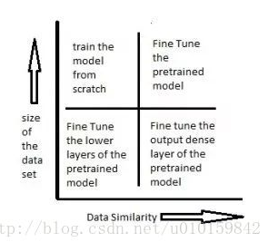
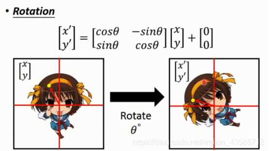
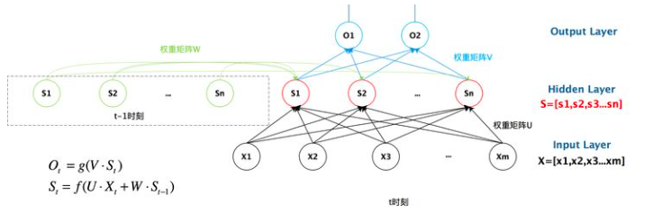
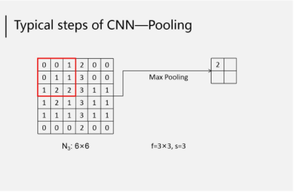
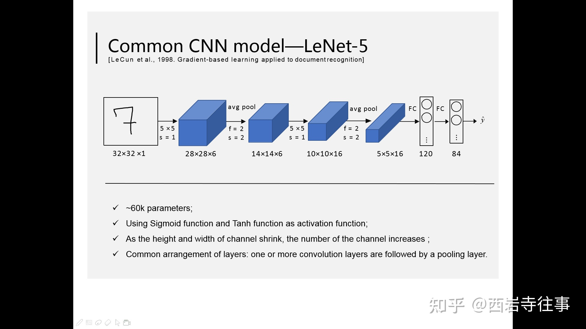

# 深度学习

### 0. 基础知识

学习深度学习或者机器学习，通常使用两个框架tensorflow（商业）、pytorch（科研）。我们可以使用的编译器pycharm、jupyter、Google的colab、kaggle等。

pytorch可以运行在GPU上，GPU的cuda:0, cuda:1, ... 等价于CPU的核数，即cuda数量越多，运行速度越快。查看电脑有没有GPU，torch.cuda.is_available()

模型不好的指导方法：


### 1. Pytorch的基础

####  1.1  一些常用命令

- conda包管理工具

  conda与pip命令的区别：

  相同点：两者都是包管理工具

  不同点：conda可以安装python库以外的库，例如C语言库； pip不可以。

#### 1.2 常用的一些库

##### 1.2.1 python常用的一些库

- pandas库：进行数据分析
- matplotlib库：主要是进行画图
- numpy库：数值运算

##### 1.2.2 pytorch常用的一些库

```python
import torch											#基础的pytorch库
from torch import nn									#创建model,损失函数等等
import pandas as pd										#数据分析，读取
from sklearn.model_selection import train_test_split    #将数据进行分成训练数据和测试数据
from torch.utils.data import TensorDataset, DataLoader  #将输入输出合成一个dataset，dataLoader可以打乱顺序，随机选取指定大小的数据对
```

#### 1.3 张量（tensor）

- pytorch最基本的操作对象是张量，他表示一个多维矩阵。类似于numpy的ndarrays，张量可以在GPU上使用以加速计算

- 创建几个特殊的张量：

  - 构造一个随机初始化的矩阵：torch.rand。 如torch.rand(2,3) 生成2*3的0-1的矩阵。torch.randn()生成的矩阵还符合正态分布

  - 创建一个全0矩阵：torch.zeros

  - 全1矩阵：torch.ones

  - 直接从数据构造张量：torch.tensor 

    ```python
     torch.tensor([6,2], dtype=torch.float32)
     tensor([6., 2.])
    ```

    

##### 1.3.1  张量的运算

遵循**对应元素相加减乘除**、**广播方式**。与MATLAB一致

add   <=(等价于)=>  +          x1 + x2 等价于 x1.add(x2)      

x1.add_(x2) 等价于 x1 = x1 + x2

**还有一些内置方法：**

x.mean()     x.sum()

x.item() 	当x tensor只有一个值的时候，返回出这个值（标量值）

##### 1.3.2 张量形状变换

x.view(3,2)        将x转换成3*2张量

x.view(-1,1)        将x转换成x的大小*1张量，这个-1表示自动计算

##### 1.3.3 张量的自动微分

将torch.tensor属性requires_grad设置为true，pytorch将开始跟踪此张量的所有操作。完成计算后，可以调用.backward()并自动计算所有梯度，该张量的梯度将累加在.grad属性中。

with torch.no_grad（）:中的代码不会跟踪张量的变化

```python
a = torch.tensor([2,3],dtype=torch.float32)
#此时的a.requires_grad = false
a.requires_grad_(True)
```


#### 1.4 tensor的最基本数据类型

- 32位浮点型：torch.float32

- 64位浮点型：torch.float64

- 32位整形：torch.int32

- 16位整形：torch.int16

- 64位整形：torch.int64

  x.type()  查看x的类型

x.type(torch.int64) 将x转换成int64类型；类型转换

**tensor与ndarray数据类型的转换：**

ndarray --> tensor    			x2 = torch.from_numpy(x1)

tensor --> ndarray				x2 = x1.numpy()


### 2. 常见问题

#### 1. 过拟合与欠拟合

**过拟合：**对于训练数据过度拟合，对于未知数据预测很差。

**欠拟合：**对于训练数据拟合不足，对于未知数据预测很差。


#### 2. 神经网络小知识点

##### 2.1 神经网络优化失败的原因、考虑的方向：

1. 此时迭代到梯度为0（critical point，局部极小值或者是鞍点）的点。从经验上看，大部分卡在一个点（梯度为0），这个点是鞍点。卡在局部极小值的时候很少。
2.  batch可能比较大，会停留在鞍点
3.  有很多时候并没有走到critical point，由于learning rate 太大，导致一直在critical point附近来回跳。
3.  选择合适的loss损失函数，例如概率选择交叉熵就比均方根好。（pytorch中cross_entropy内部中就直接加入了softmax函数这一环节，即先算交叉熵之前先进行softmax进行normalization）。
3.  每个数据元素差别比较大，这就导致loss function在比较大的元素对应的weight变化比较陡峭，在比较小的元素对应的weight变化比较平缓。这对于优化、训练，不太好。因此，对每个元素进行normaliztion。对所有组数据对应元素求均值和方差，然后每个元素都减去均值除以方差。**batch normalization**。在测试或者是实际的时候，都是一组一组数据进行测试。那怎么进行normalization呢？均值和方差都是通过训练数据的多次均值和方差得出来的。（其实，每一层都要进行batch normalization）。总之，这个方法就是使error surface（loss function）平滑一点。

##### 2.2 为何判断梯度为0的点是局部极小值点还是鞍点？

​	对（损失）函数进行二阶泰勒展开，由于梯度等于0，所以一阶项就没有。通过二阶项的正负即可判断。

​	二阶项 > 0,  极小点； 二阶项 < 0, 极大点； 二阶项不确定（有时候>0,有时候<0），鞍点。通过线性代数可知，判断hessian矩阵是正定、负定还是不能确定，即所有特征值都是正的、负的、正负都有。

如果是鞍点，那么就可以继续更新参数，参数增量就是H对应特征值小于0的特征向量。实际上，很少采用这一招。因为求解hessian矩阵很难，还要求特征值和特征向量。

##### 2.3 为什么每次训练要有batch，不能一个一个或者是全部一起么

​	如果一个数据就进行计算一个loss，并且更新参数，会出现更新快（冷却快），但不稳；

​	如果所有数据运算完计算一个loss，再更新，会出现更新慢（蓄力长），需要计算完所有的数据，但比较稳。

对于并行计算、GPU，更新也不算慢。并行计算解决了large batch的缺点，但large batch训练的模型一般精度不高，不如small batch。

为什么large batch的模型还没small batch好？

​	因为large batch很可能会停留在鞍点，small batch就不太会。

##### 2.4  gradient descent 梯度下降法的改进

​	我们每次不只是朝着梯度下降的方向移动，这一时刻的移动方向取决于这一时刻梯度的反方向和上一时刻的运动方向。即，这一时刻梯度的反方向+上一时刻的运动方向（冲量，momentum）就是要移动的方向。

##### 2.5 梯度下降法的更新版

**pytorch中的Adam算法就是利用：RMS + momentum进行更新**

一下就是传统的梯度下降法转换成更新后的：


一般$\sigma_i^t$有这两种选择方式：


learning rate scheduling的选择：


#### 3. 优化方法

1. SGD（梯度下降法）

2. SGDM（梯度下降法+冲量）

   该算法收敛慢，但是比较稳定，效果比较好

3. Adam

   该算法收敛快，但效果没那么好

4. SWATS

​	 该算法开始是Adam算法，后面是有SGDM算法


### 3. 关于机器学习的一些知识点

#### 1. 迁移学习（Transfer Learning）

使用一个由他人预先训练好，应用在其他领域的网络，可以作为我们训练模型的起点，不必重新训练。不论是有监督学习，无监督学习还是强化学习，迁移学习的概念都有广泛的应用。

举图像识别中最常见的例子，训练一个神经网络。来识别不同的品种的猫，你若是从头开始训练，你需要百万级的带标注数据，海量的显卡资源。而若是使用迁移学习，你可以使用Google发布的Inception或VGG16这样成熟的物品分类的网络，只训练最后的softmax层，你只需要几千张图片，使用普通的CPU就能完成，而且模型的准确性不差。

使用迁徙学习时要注意，本来预训练的神经网络，要和当前的任务差距不大，不然迁徙学习的效果会很差。例如如果你要训练一个神经网络来识别肺部X光片中是否包含肿瘤，那么使用VGG16的网络就不如使用一个已训练好的判断脑部是否包含肿瘤的神经网络。后者与当前的任务有相似的场景，很多底层的神经员可以做相同的事，而用来识别日常生活中照片的网络，则难以从X光片中提取有效的特征。

迁移学习的方式主要有：

- 训练最后输出的几层
- 对整个网络进行微调，假设你已训练好了识别猫品种的神经网络，你的网络能对50种猫按品种进行分类。接下来你想对网络进行升级，让其能够识别100种猫，这时你不应该只训练网络的最后一层，而应该逐层对网络中每个节点的权重进行微调。显然，只训练最后几层，是迁移学习最简单的1.0版，而对节点权重进行微调（fine turing），就是更难的2.0版，通过将其他层的权重固定，只训练一层这样的逐层训练，可以更好的完成上述任务。
- 借用网络结构，即不是使用已训练好的网络的权重，而是使用相同的网络结构，例如多少层，每层多少节点这样的信息，然后使用随机生成的权重作为训练的起点。例如你要训练世界上第一个识别fMRI图像的神经网络，你就可以借鉴识别X光图片的神经网络。

接下来的这幅图说明了该用哪种迁移学习：



1）右下角场景，待训练的数据集较小，已训练的模型和当前任务相似。此时可以只是重新训练已有模型的靠近输出的几层，例如将ImageNet中输出层原来可以判别一万种输出的网络改的只能判别猫的品种，从而利用已有网络来做低层次的特征提取。

2）左下角场景，待训练的数据集较小，已训练的模型和当前任务场景差距较大。例如你有的已训练网络能识别出白天高速路上的违章车辆，你需要训练一个能识别出夜间违章车辆的模型，由于不管白天夜晚，交通规则是没有变化的，所以你需要将网络靠近输入的那几层重新训练，等到新的网络能够提取出夜间车辆的基本信息后，就可以借用已有的，在大数据集下训练好的神经网络来识别违章车辆，而不用等夜间违章的车辆的照片积累的足够多之后再重新训练。

3）左上角场景，待训练的数据集较大，已有的模型和新模型的数据差异度很高。此时应该做的是从头开始，重新训练。

4）右上角场景，待训练的数据集较大，已有模型的训练数据和现有的训练数据类似。此时应该使用原网络的结构，并保留每一层的节点权重，再逐层微调。

#### 2. 无监督学习-Word embedding

**对字或者词进行编码方式：**

1.  one hot vector。向量的维度是所有字或者词的个数。缺点: 维度太高、字与字，词与词之间的关系没有
2.  class分类。例如动物分一类，植物分一类，动作分一类。缺点动物与动作之间的关系不明显，即，任意两个类之间的关系
3.  Word embedding。根据文章上下文。


**How to exploit the context?**

1. count based。如果两个Word $w_i$、$w_j$频繁的一起出现，两个Word对应的向量彼此很接近。即，两个Word的向量的内积和接近于他们一起出现的次数。
2. prediction based。训练一个网络，输入时这一时刻或前几时刻的词，输出是下一时刻是哪个词的概率。那么该网络first隐含层的输入就代表这个词的向量。


​	大致步骤就是：

   1. 首先从网上进行网络爬虫得到一些文章

   2. 进行训练

      

prediction based的一些变形：根据两边的值预测中间的值；根据中间的值预测两边的值。。。。


应用：

​	OCR中文字就需要转换成向量。通过这种方式给文字或者动物图片等等进行编码（变成向量），下次给你一个图片识别图片中的文字，可能图片中的文字不清楚或者之前没见过，通过得到的向量判断离哪个文字比较近，就可以识别大概。

#### 3. Spatial Transformer layer

**CNN并不存在几个特性：**
1.Scaling的特性，filter size尺寸固定的情况下，大只狗与小只狗的形状并没有办法自动缩放辨识。
2.Rotation的特性，『3』转过来看起来对机器而言就是『m』。
3.也许仅有些许的Translation，但移动过多情况下对CNN来说也是不一样的。

也许照片上有着缩小的『5』、『6』，但对机器而言两个数字应该就是很大，即使是单纯的缩放，对CNN而言也是不一样的东西。
**因此Spatial Transformer Layer想做的事就是将图片做旋转缩放，让特征可以符合机器识别。**
Spatial Transformer Layer本身也是一个NN layer，可以跟CNN并在一起直接训练，不仅可以Transform输入，所有的feature map都可以。

寻找各个weight，然原图片进行旋转、缩放等操作。




因此，对图像进行旋转、平移、缩放都综合到一个式子上：


(x,y),(x′,y′)是图像的索引。我们只需要辨识6个参数就够了。

这里训练的参数如果是小数，这就导致(x′,y′)可能也是小数，即对应的坐标是小数。这怎么办？对(x′,y′)进行四舍五入吗？如果是四舍五入那gradient descent就没办法使用，不能训练出这种网络。

spatial transformer layer的完整结构：


这个网络可以加入到CNN的任意位置，而且相应的计算量也很少。
将 spatial transformers 模块集成到 cnn 网络中，允许网络自动地学习如何进行 featuremap 的转变，从而有助于降低网络训练中整体的代价。定位网络中输出的值，指明了如何对每个训练数据进行转化。

#### 4. 无监督学习、半监督学习、有监督学习

有监督学习：对数据的输出进行label标签，有输出，有正确答案

半监督学习：有一部分数据是有输出，正确答案的，并且有一大部分数据是没有输出label的。通过label的数据训练模型，然后对unlabel的数据进行计算数据，通过一定的筛选（例如，信心比较大的一些数据），将部分数据转换成hard label并将其放入到train set中，将他们归结为label的集合

无监督学习：所有的数据 全部都是unlabel的。例如给他一篇文章，给出前几个字进行预测下一个字；给机器一些对话进行自我学习；给一些图片机器可以产生类似的图片。。。。这些都没有进行人工标注。


### 4. 深度学习算法

#### 0. 常用激活函数

**Sigmoid函数：**主要用于逻辑回归的输出


**relu函数：**


**tanh函数：**


**Leak relu函数：**


#### 1. 有监督学习

##### 1. 线性回归

​	线性回归使用的损失函数一般是均方差函数

​	在pytorch中，使用nn.MSELoss()表示均方差。


##### 2. 逻辑回归

**几个概念：**

**信息量：**信息是用来消除随机不确定性的东西。也就是说衡量信息量的大小就是看这个信息消除不确定性的程度。**信息量的大小与信息发生的概率成反比。**

设某一事件发生的概率为P(x)，其信息量表示为：

​														*I*(*x*)=−log(*P*(*x*))

**信息熵：**信息熵也被称为熵，用来表示所有信息量的期望。


**相对熵(KL散度)：**如果对于同一个随机变量X 有两个单独的概率分布P ( x ) 和Q ( x ) ，则我们可以<strong style="color:red;">使用KL散度来衡量这两个概率分布之间的差异。</strong>


KL散度越小，表示P ( x ) 与Q ( x ) 的分布更加接近，可以通过反复训练Q ( x ) 来使Q ( x ) 的分布逼近P ( x ) 。
	

**交叉熵：**


交叉熵的公式：


在机器学习训练网络时，输入数据与标签常常已经确定，那么真实概率分布P ( x ) 也就确定下来了，所以信息熵在这里就是一个常量。由于KL散度的值表示真实概率分布P ( x ) 与预测概率分布Q ( x ) 之间的差异，值越小表示预测的结果越好，所以需要最小化KL散度，而交叉熵等于KL散度加上一个常量（信息熵），且公式相比KL散度更加容易计算，所以在机器学习中常常使用交叉熵损失函数来计算loss就行了。
**总结：**
交叉熵能够衡量同一个随机变量中的两个不同概率分布的差异程度，在机器学习中就表示为真实概率分布与预测概率分布之间的差异。交叉熵的值越小，模型预测效果就越好。

交叉熵在分类问题中常常与softmax是标配，softmax将输出的结果进行处理，使其多个分类的预测值和为1，再通过交叉熵来计算损失。

**对于分类问题，我们最好使用交叉熵损失函数会更加有效，交叉熵会输出一个更大的“损失”**。对于分类问题也可以使用均方差损失函数（这个有个问题，可能输入很大，但输出只在0-1之间，均方差会很小，和输入不在一个数量级上，改进会比较慢），而交叉熵损失函数却不然（它可以放大损失。如果期望概率是1，而你得到的是0，交叉熵得到的结果会是无穷大）。

在pytorch中，我们使用nn.BCELoss()计算二元交叉熵（即，输出是0和1的形式）。

##### 3. 多层感知器（神经网络）

上一节的逻辑回归模型是单个神经元：

- 计算输入特征的加权和
- 然后使用一个激活函数（或传递函数）计算输出

单层神经元的缺陷：无法拟合“异或”运算。神经元要求数据必须是线性可分的，异或问题无法找到一个直线分割两个类。

多层感知器组成：

​			输入层、隐含层、输出层


##### 4. RNN（循环、递归神经网络）

###### 4.1 为什么要引进循环神经网络？

将神经网络模型训练好之后，在输入层给定一个x，通过网络之后就能够在输出层得到特定的y，那么既然有了这么强大的模型，为什么还需要RNN（循环神经网络）呢？

神经网络都只能单独的取处理一个个的输入，前一个输入和后一个输入是完全没有关系的。但是，某些任务需要能够更好的处理**序列**的信息，即前面的输入和后面的输入是有关系的。例如NLP，OCR，一些视频处理都需要前后文。

###### 4.2 基本RNN的结构组成

一个简单的循环神经网络是由输入层、隐藏层和输出层组成：


U是输入层到隐藏层的权重矩阵，V是隐藏层到输出层的权重矩阵。循环神经网络的隐藏层的值s不仅仅取决于当前这次的输入x，还取决于上一次隐藏层的值s。权重矩阵 W就是隐藏层上一次的值作为这一次的输入的权重。

这个抽象图对应的具体图：



将上面的图展开，循环神经网络按照时间展开如下：


公式化结构：

****

公式：


 为隐藏层的净输入， 和  为非线性激活函数 (通常取  或  /  函数)， 为状态-状态权重矩阵， 为状态-输入权重矩阵， 为输出-状态权重矩阵。

###### 4.3 双向RNN（**Bidirectional Recurrent Neural Network, Bi-RNN**）

对 语言模型 而言，很多时候只看前面的词是不够的。


 根据上一节的公式与符号，时刻  的 正向隐藏层输出 、反向隐藏层输出  与 预测输出  分别为：


其中，**正向计算和反向计算各具独立的权重而不共享**。

###### 4.4 深度RNN

 前面介绍的 RNN 只有一个隐藏层，若 **堆叠两个以上的隐藏层**，则得到 **深度循环神经网络 (Deep Recurrent Neural Network)**，如下图所示：


 沿袭先前的符号设定，则设时刻  的第  个隐藏层输出为  和 ，，则有：


同样地，各隐藏层具有独立的权重而不共享。

###### 4.5 循环神经网络的特点

**优点：**

1. 适合处理序列数据，因为考虑了之前的信息
2. 可结合 CNN 使用得到更好效果
3. 对输入数据无尺寸固定要求 (可以是不定长数据，但通常还是习惯填充/截断到固定长度)

**缺点：**

1. 存在梯度消失/弥散、梯度爆炸问题，难以处理长序列
2. 较其他 CNN 和 FC 要用更多的显存空间，更难训练


##### 5. LSTM（长短期记忆网络）


###### 5.1 LSTM结构

Long Short Term Mermory network（LSTM）是一种特殊的RNNs，可以很好地解决长时依赖问题。

LSTM的结构与RNN相似，不同的是它的重复模块会比较复杂一点，它有四层结构：


###### 5.2  **LSTMs的核心思想**

理解LSTMs的关键就是下面的矩形方框，被称为memory block（记忆块），主要包含了三个门（forget gate、input gate、output gate）与一个记忆单元（cell）。方框内上方的那条水平线，被称为cell state（单元状态），它就像一个传送带，可以控制信息传递给下一时刻。


LSTM可以通过门控单元可以对cell添加和删除信息。通过门可以有选择地决定信息是否通过。

**逐步解析LSTM：**

1. LSTM第一步是用来决定什么信息可以通过cell state。这个决定由“forget gate”层通过sigmoid来控制，它会根据上一时刻的输出决定通过或部分通过。

   

2. 第二步是产生我们需要更新的新信息。这一步包含两部分，第一个是一个“input gate”层通过sigmoid来决定哪些值用来更新，第二个是一个tanh层用来生成新的候选值相加，得到了候选值。

   一二步结合起来就是丢掉不需要的信息，添加新信息的过程：

   

3. 最后一步是决定模型的输出，首先是通过sigmoid层来得到一个初始输出，然后使用tanh将
   值缩放到-1到1间，再与sigmoid得到的输出逐对相乘，从而得到模型的输出。


这显然可以理解，首先sigmoid函数的输出是不考虑先前时刻学到的信息的输出，tanh函数是对先前学到信息的压缩处理，起到稳定数值的作用，两者的结合学习就是LSTM的学习思想。至于模型是如何学习的，那就是后向传播误差学习权重的一个过程了。

###### 5.3 实际是如何使用LSTM？


输入通过一系列的网络分别产生四个输出以此作为LSTM的四个控制门的输入。

##### 6 CNN（Convolutional Neural Networks，卷积神经网络）

卷积神经网络主要是针对于图像的特点而设计的一种神经网络，卷积核就是查看图像的一部分，一个图像根据几个部分的特征可能就可以判断。当然，理论上图像辨识也可以使用全连接网络，但全连接需要的参数会很多，难训练，还可能出现过拟合的情况，效果不如卷积神经网络。

CNN还可以用在下围棋，playing Go。目前也应用到NLP上。

###### 6.1 卷积神经网络的基础知识

卷积神经网络主要是以灰色图（单通道）或者彩色图（RGB三通道）为例。

1. 卷积（convolution）

   卷积是基于查看一个图片的一部分。一个卷积核（表示一个特性，例如嘴，腿，羽毛等等）对整个图片扫描一遍，就表示查看这个图片有没有该特性的部分，一般一次卷积会有好几个卷积核，分别表示不同的特性。

   

   原图片依次和卷积核（过滤器）进行卷积，即对应元素相乘并相加。这里的stride是指的步长，f表示卷积核的大小，边长,一般kernel size是3\*3，大点也就7\*​7, 9\*9。

2. 填充（padding）

   卷积会是表格（图像）减小，有些情况下不期望出现这种情况，可以采用填充的方式来处理，填充其实就是进行卷积之前的一些预处理

   

3. 池化（pooling）

   在卷积之后，经常进行池化处理（这不是必须的）以进一步减少运算量。池化一般分为最大池化和平均池化。**池化的作用就是减少运算量，如果你的计算资源足够强，完全可以不用使用池化这个环节**。目前，已经有很多人做全是convolution（卷积）的，不用pooling。

   **池化基于图像去掉一行一列对整体没什么影响**。例如，去掉奇数行和奇数列，对图片没影响。因此，pooling对下围棋就不行，围棋去掉某些行或者列均不行。




###### 6.2 多通道问题

以上是单通道（即一个“图像”）的情况。在实际应用中，CNN往往是多通道的情形，如RGB


只是卷积核的数目变多了，卷积仍然没有变。


以上便是卷积神经网络所特有的步骤，再经过多次卷积、池化之后，数据将被输入全连接神经网络（Fully connected neural network，FC）中，输出最终结果。以二分类问题为例，下图展示了CNN所涉及的主要环节：


###### 6.3 卷积运算与FC（全连接）关系

实际上，卷积运算相当于FC中的隐藏层所做的运算（为便于介绍主要原理，以下忽略了激活函数部分的运算过程），大小为3*3的图像与2*2的卷积核进行卷积，步长为1，卷积过程等效为以下四个图所反映的过程：


。。。。。。


可以看到，卷积核中的参数相当于神经元中进行线性运算的权重，且图中隐藏层中的各个神经元都采用这些权重（即“权值共享”），且对于每个神经元来说，仅需计算部分的输入数据，这体现出“稀疏连接”的特点（相较于全连接FC）。

###### 6.4 经典的CNN

-  LeNet-5



- AlexNet


- VGG-16


还有ResNet、GoogLeNet。


##### 7. 自注意力机制（self-attention）

###### 7.1 该网络工作内容

这个解决的是输入是一个向量集合，每个向量之间的存在关系，而不单纯的只是一个向量，可能集合中的向量个数也不同。例如，翻译可能需要上下文的词义，一段文字，一段语音，一个graph图 它们之间都有联系。

输出的类型：

1. 每一个向量对应一个label。输入向量集合中有多少向量，输出就有多少scalar或者classification；例如，对一段文字进行词汇标注
2. 一整个sequence只输出一个label。例如，sentiment analysis 分析一句话是正面的还是负面的；同一段声音判断是谁讲的
3. 不知道输出多少，由机器决定。seq2seq。例如，机器翻译、语音辨识（输入一段话输出一段文字）

###### 7.2  输入向量编码方式

假设，“this is a cat"作为输入，那么每一个词就是一个向量。怎么对每个词进行编码呢？

1. one hot vector，找一个向量的大小等于所有词汇的个数，每一个单词对应一个one hot vector，但这种有一个缺点，不能区分每个词之间的相关性；
2. Word Embedding。他们会根据词汇进行编码。例如，动物之间的向量编码比较接近。

###### 7.3 针对于第一种输入类型（sequence labeling）

self attention的结构图：


self-attention环节是考虑了前面输入的所有关系得到的输出。

**为什么不使用全连接，而是self-attention？**

- 全连接参数多，训练难是其一，模型比较复杂会出现过拟合情况
- 输入的个数不确定，模型结构也不好设计

**self-attention大致结构：**

求解任意两个向量直接的相关性$\alpha_{i,j}$​


计算$\alpha_{i,j}$的方法有很多，例如点乘法（常用），additive。。。。


**self-attention具体结构：**

1. 计算向量相关性


2. 计算self-attention的输出

   

这个self-attention没有考虑各个向量之间的位置关系，谁在前面谁在后面，谁挨着谁，它只考虑了任意两个向量之间的相关性。解决方法：每个向量加上一个位置向量，位置向量有很多方式来产生。

**针对于语音的时候**，因为都是25ms作为一个窗口，每次移动10ms的距离。因此，1s的语音就会有100个向量，矩阵就会特别大，运算量太大，几乎不能训练。所以，使用truncation self attention截断的自注意力机制，只关注这句话的前后几个，不需要关注整段语音，至于前后多少视问题而定。

**针对于图像识别**，每个像素RGB作为一个三维向量，图片就可以看做一个vection set。**CNN就是self attention的特例。**

**self attention与RNN的区别：**

​	self attention的运算是并行的，而RNN不是并行的，因此RNN逐渐被self attention取代。


##### 8. graph neural network（GNN）

在CNN中对图片有卷积进行处理。同样在graph中有没有类似于卷积的东西进行处理？


有两种方式：

1. spatial-based convolution

   术语：

   ​	aggregate：用neighbor feature 更新下一层的hidden state；类似于CNN的卷积

   ​	Readout：把所有node的feature集合起来代表整个graph的feature。这样就可以完成graph的分类或者是预测

2. spectral-based convolution


##### 9. transformer

###### 9.1 相关概念

sequence-to-sequence(seq2seq)

输出一个sequence，输出一个sequence，输出的长度由机器来定。

**speech recognition（语音辨识）**：输入一段语音输出相应的文字。

**machine translation（机器翻译）**：输入一段文字输出一段文字。例如，输入一段中文输出一段英文。

**speech translation（语音翻译）**：输入一段语音输出翻译之后的文字。例如，输入一段中文语言输出一段翻译之后的英文文字。这个为什么不是语音辨识+机器翻译？因为，可能有些语音没有文字，例如粤语。

**text-to-speech（TTS）synthesis（语音合成）**：输入文字输出语音。例如输入中文，输出响应英文语音。


multi-class classification与multi-label classification的区别：

multi-class classification，例如给一个动物图片结果是这个是哪个动物，结果只属于一个class；

multi-label classification，例如一篇文章可能属于很多类，即使说明文又是叙述文。


###### 9.2 transformer

**transformer的结构：**


**transformer中encoder的结构：**


**transformer中decoder的结构：**

decoder主要分两种：autoregressive(AT)和Non-autoregressive(NAT)

**autoregressive结构：**

这里的masked multi-head attention与传统的self-attention还是有区别的。传统的self-attention是考虑所有输入，而masked multi-head attention只考虑当前时刻以及之前的输入，之后的输入是看不到的。


error propagation是指某一时刻输出错误，之后的时刻是不是接着输出错误的，即误差传播。

在所有的输出的集合（可能的输出，例如，如果是输出中文，输出集合就是所有中文文字）中需要额外加两个字符start和end。输出end表示输出结束，否则，就要一直运行下去。

**Non-autoregressive(NAT)结构：**


NAT decoder的输出长度如何确定（一般两种方法）？

1. 再找一个预测器，输出是句子可能的长度。然后，NAT Decoder的输入start的个数就确定了；
2. 输出一个很长的句子，忽略输出end之后的字符。例如，假设句子的最长是300个文字，输入300个start，输出300个文字中，忽略掉end之后的字符。

NAT的优势：

​	并行计算（最大优势），NAT的计算速度比AT速度快；可控的输出长度

NAT的缺点：

​	精度不如AT，可能生成的图片是叠加态，比较模糊，生成的句子或者翻译也不行。

**针对NAT的缺点的解决方法：**

1. 让autoregressive做teacher，non-autoregressive做student，non-autoregressive跟着autoregressive学

2. noisy parallel decoding。

3. fertility。通过encoder产生每个单词翻译出几个字，例如hello翻译成两个字，然后decoder的输入就有两次hello。

   接下来的图片是修改non-autoregressive的几种常用方法：

   

   **迭代调整的方法：**1.encoder输出decoder输出的长度，对decoder的输出进行迭代运算，不断修正；2.encoder输出decoder输出的长度，decoder换成bert，对bert进行迭代，但是在每次迭代的时候将规律低的换成mask作为输入。

   **insert+delete的方法：**

   ​	**insert+delete的训练：**

   


###### 9.3 训练小tips：

**teacher forcing**：在进行训练的时候，decoder的输入都是正确答案，即使前一时刻的decoder输出都是错误的。

**exposure bias**：在训练的时候，decoder的输入都是正确答案；但是在test的时候，decoder的输入都是上一时刻decoder的输出，如果上一时刻的decoder的输出是错误的，那么接下来所有的输出可能都是错误的。解决方法：我们在train的时候，故意放一些错误的decoder输入。

**copy mechanism**：在训练的时候可能会出现一些copy的情况，例如，在机器对话中，你好，我是XXX，这个XXX不需要机器自己学习，直接复制即可。这就涉及到copy mechanism机制。

**beam search：**一般选择的输出$w_i$​​都是概率最大的，然后将它作为下一时刻的输入。有没有可能开始我们选择一个概率不是最大的，后面的输出更好呢。bean search有时很有用，有时很没用，主要是看你的任务。如果你的任务的答案是很明确的，可能选择概率最大的是很好的；如果你的任务需要一些创造力（如，给你文章一半，机器产生另一半；TTS），可能选择概率最大的就不是最好的，decoder可能需要一些随机性。

**BLEU score：**对于两个句子的差异性。差别越大，BLEU score越小；差别越小，BLEU score越大。最终衡量一个训练结果的好坏使用的就是BLEU score。但是，在每次训练的时候，使用的是交叉熵cross-entropy，看两个字的交叉熵。


#### 2. 无监督学习

##### 1. 生成对抗网络（Generative Adversarial Net,GAN）

###### 1.1 原理


 GAN的主要灵感来源于博弈论中零和博弈的思想，应用到深度学习神经网络上来说，就是**通过生成网络G（Generator）和判别网络D（Discriminator）不断博弈，进而使G学习到数据的分布**，如果用到图片生成上，则训练完成后，G可以从一段随机数中生成逼真的图像。G， D的主要功能是：

- G是一个生成式的网络，它接收一个随机的噪声z（随机数），通过这个噪声生成图像
- D是一个判别网络，判别一张图片是不是“真实的”。它的输入参数是x，x代表一张图片，输出D（x）代表x为真实图片的概率，如果为1，就代表100%是真实的图片，而输出为0，就代表不可能是真实的图片


训练过程中，生成网络G的目标就是尽量生成真实的图片去欺骗判别网络D。而D的目标就是尽量辨别出G生成的假图像和真实的图像。这样，G和D构成了一个动态的“博弈过程”，最终的平衡点即纳什均衡点.


###### 1.2 损失函数（loss）


用公式表示：


其实这个式子可以分解成两个式子：

优化D:

​												

优化G:

​													

需要注意的是生成模型与对抗模型可以说是完全独立的两个模型，好比就是完全独立的两个神经网络模型，他们之间没有什么联系。

好了那么训练这样的两个模型的大方法就是：**单独交替迭代训练**。

因为是2个网络，不好一起训练，所以才去交替迭代训练。

###### 1.3 训练步骤

1. 首先generator先产生一部分假的数据，将这些假数据标注为0，从真数据中选择一部分标注为1。然后交给discriminator进行学习，训练判别器能很好地区分哪一部分是真的，哪些是假的数据（此时的损失函数是第一个分解的式子，即优化D的式子），真的数据尽可能输出1，假的数据尽可能输出0。
2. generator再次产生假数据，此时我们希望这些假数据能欺骗判别器，让这些数据输入到判别器尽可能的输出1（此时的损失函数是第二个分解式子，即优化G的式子），这里保证D的参数是不变的，通过loss来调整生成器的参数。
3. 然后循环上述两个步骤。直到判别器无法分辨真假数据为止。

###### 1.4 GAN的各种变形及应用场景

GAN是一种Structure learning，不像分类问题，多种输入对应一种输出。这可能会出现没有遇到的情况，因此需要它具有创造力。GAN是一种无监督学习。

GAN的变形：

- DCGAN
- WGAN
- WGAN_GP
- LSGAN
- f-GAN
- ................

应用场景：

- 图像领域：根据文字生成对应图像、由图像到图像的转化（黑白图到彩色图等等）、提升图片分辨率，改善图片质量
- 视频领域：预测视频下一帧、利用场景生成视频
- 人机交互领域

###### 1.5 GAN的train tips

GAN在实际中很难训练。

在实际训练中，discriminator判别器总是能100%的区分是real sample还是generator 产生的data，这就没办法进行训练，无论你怎么训练、调节参数都能100%区分。原因：图片其实是高维向量，对应高维空间，在高维空间只有一小部分空间表示的是图片，real sample data与 generator data是没有交集的，因此判别器总能100%进行区分。判别器与JS divergence有关。

改进：虽然没有交集，但我们要判别就可以通过距离，real sample data与generator data之间的距离，Wassertein distance。


WGAN的难点就是D判别器必须是smooth。可以这样想，GAN的判别器是只有real sample data是1，其他的data是0，因此可以100%进行区分，类似于一个方波；而WGAN是光滑的，斜率不能是无穷大平滑的方波，训练模型、改变参数，loss function就会发生变化。

训练的时候会出现几种情况：

- mode collapse：产生的图像几乎是一样的，大量类似的图片。在train的时候，可能generator发现一个图片附近是discriminator的盲点，然后就疯狂在这个附近产生图片


- mode dropping：产生的图片只是real sample data的一部分


###### 1.6  quality of image

评价两个图片集合是否相似或者是图片质量的方法：

1. 通过人眼观看，人进行评价。 缺点：不客观，成本高
2. 产生一个影像分类系统，将图像丢进这个影像分类系统，如果输出是非常集中，集中于某一个类，证明图片质量越好。

图片多样性的指标：

​	将所有的图片放入到影响分类系统，如果所有图片的概率分布的平均都差不多，即每个类的产生的图片个数差不多，多样性就越好。


图片多样性是概率越平摊越好，图片质量是概率越集中越好。一个是看整体，所有图片；一个是但看一张图。

Inception Score：图片质量高，多样性越多，则IS越大。

###### 1.7 conditional GAN


这里是有条件的GAN，之前都是unconditional GAN，没有x。这个可以用作text-to-image，x为输入的文字，生成符合条件的图片。**有条件的GAN是有监督学习。**你如果输入红眼睛，那你就要有一些红眼睛的图片，用作discriminator的输入。


###### 1.8 Cycle GAN


要生成一个真人图像，生成对应的二次元头像。这里真人图片一个集合，二次元图片一个集合，但他两个没有一一对应的关系。增加了一个橙色环节,要不然真人图片与二次元图片就没有办法进行对应，否则你随便输入一个高斯分布的向量，可能也能够生成一个二次元图片。


##### 2.  generative models

1.  Pixel RNN: 输入之前的像素就会产生接下来这一时刻的像素，以此往复。


2. Variational Autoencoder(VAE):


Auto-encoder是输入输出是同一个图片，图片经过encoder进行编码得到code，然后code通过decoder进行解码得到图片。之后，decoder单独拉出来，code输入一些随机的相同维度的向量，就可能得到各式各样的image。

但是这种在实际中performance不理想。


VAE是Auto-encoder的变形，encoder会产生两个向量，然后从正态分布产生一个相同维度的向量，通过一定运算。

产生的两个向量一个表示均值，一个表示方差，使得C向量符合正态分布。以后将decoder作为生成器的时候，输入就可以是正态分布了。相当于在Autoencoder的decoder上加入噪声，增加鲁棒性。

3. Generative Adversarial Network(GAN):


##### 3. Auto-encoder


**autoencoder的作用：**

	1. 输入的图片是一个很高维的向量，vector是一个比较低维的向量，下游任务对图片这种高维向量很难处理，就可以将这vector代替图片做下游任务中，下游任务对vector进行处理，而不是图片。
	2. 去掉noisy。


**dimension reduction：**将高维向量转换成低维向量，例如，高维图片转换成vector。

**future disentangle：**区分一个向量的每个元素代表的特征。应用：voice conversion。例如，autoencoder的encoder可以将声音转换成100维的向量，前50维表示声音内容，后50维表示说话者的特征。这样后50维换成另一个人的，这样就可以转换voice了。

**Auto-encoder的应用：**故障检测。例如癌症检测，直观上可以简化为二分类问题。但是二分类问题需要大量的data，有癌症的和没有癌症的，但往往有癌症的很少，没有足够的数据进行学习。这就很难使用二分类进行训练网络。可以使用Auto-encoder，在训练中使用大量的正常人作为train data，输入一个正常的，返回1。在测试的时候，输入一个人看能不能还原。


#### 3. 自监督学习（self-supervised Learning，SSL）

自监督学习中的模型名字一般都是以动画片芝麻街的人物为原型来命名的。ELMO、BERT、GPT-2、Megatron、T5、Switch Transformer。。。。

**Bert本质是transformer 的encoder，GPT本质是transformer的decoder。**

##### 1. Bert

bert主要是两个功能：填空、两句话是否联系。

**填空：**


对黑色的文字进行识别，将要识别的字用特殊的向量或者是随机向量进行表示

**两句话是否联系：**


**使用bert的方式：**


**使用bert的主要分两部分：**

1.  Pre-train: 利用bert的填空进行提前训练，得到参数。
2.  Fine-tune:  针对期望的任务，在提前通过bert填空预训练好的参数作为初始参数进行细微的调整。


##### 2. GPT

提前预训练是，给句子前半段，补齐后半段。


